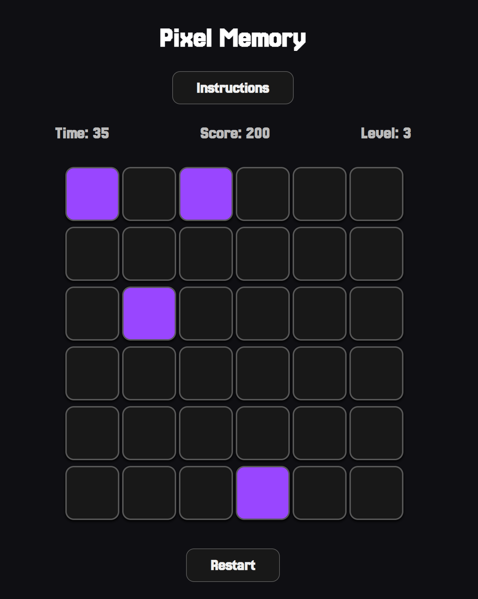

# Pixel-Memory

## Table of Contents 
1. About the Project
2. 
3. 
4. 
5. 

## About the Project

Pixel Memory is a tile-based memory game where players must remember and select the correct tiles as levels progress. The game tests memory, accuracy, and speed with an increasing level of difficulty.

### How to Play

- A few tiles will be briefly **highlighted**, memorize their positions.
- Once the highlight disappears, **click the same tiles** to proceed.
- Be careful! Clicking a wrong tile ends the game.
- Reach **Level 7** before time runs out to win.

## Features

- 6 levels of increasing difficulty.
- 45-second timer to challenge your speed.
- Visual feedback for game over/win conditions.
- Sound effects for level win and game over.
- Instructions popup.

## Tech Stack

- HTML5
- CSS3
- JavaScript (Vanilla)

## Project Structure

